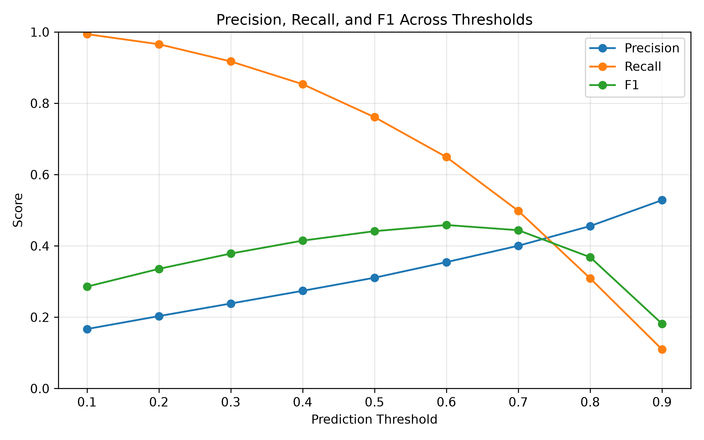
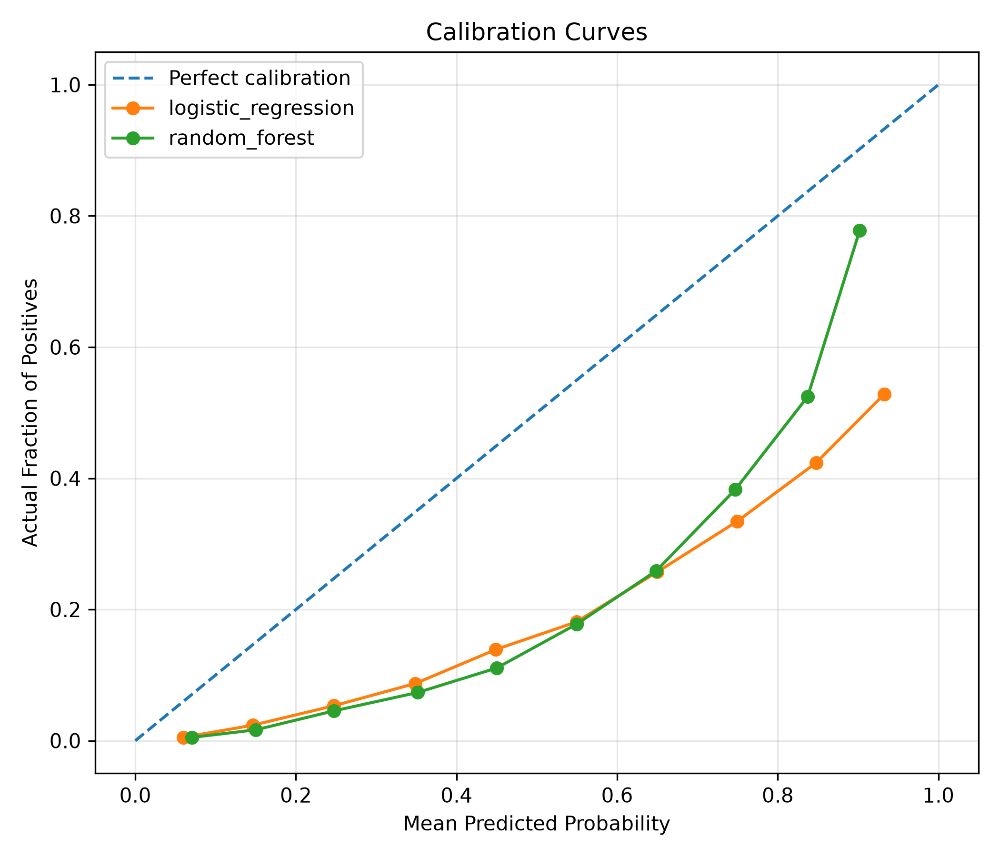

# HealthRiskLab

HealthRiskLab is a diabetes risk model evaluation project using the CDC Diabetes Health Indicators dataset.

The goal is not just to train a classifier, but to evaluate health-risk prediction models carefully under class imbalance.

## Project Goal

This project predicts whether a survey respondent has diabetes or prediabetes based on health, lifestyle, and demographic indicators.

Target:

- `0` = no diabetes
- `1` = diabetes or prediabetes

The project focuses on:

- baseline model comparison
- precision/recall tradeoffs
- threshold analysis
- confusion matrix analysis
- calibration analysis

## Why This Project Matters

The dataset is imbalanced:

| Class | Meaning | Percentage |
|---|---|---:|
| 0 | No diabetes | 86.07% |
| 1 | Diabetes or prediabetes | 13.93% |

Because only about 14% of examples are positive, accuracy can be misleading.

A model that predicts "no diabetes" for everyone gets about 86% accuracy, but catches 0% of diabetes/prediabetes cases.

So this project evaluates models using metrics beyond accuracy, including precision, recall, F1, ROC-AUC, average precision, calibration, and threshold behavior.

## Dataset

The dataset contains:

- 253,680 rows
- 21 features
- no missing values

Example features include:

- high blood pressure
- high cholesterol
- BMI
- smoking history
- physical activity
- general health
- difficulty walking
- age category
- education
- income

## Models Compared

The current project compares:

1. Dummy classifier
   Always predicts the most common class.

2. Logistic regression
   Simple linear baseline model.

3. Random forest
   Tree-based model that can capture more complex feature interactions.

## Baseline Results

| Model | Accuracy | Precision | Recall | F1 | ROC-AUC | Average Precision | Positive Rate Predicted |
|---|---:|---:|---:|---:|---:|---:|---:|
| Dummy Most Frequent | 0.8607 | 0.0000 | 0.0000 | 0.0000 | 0.5000 | 0.1393 | 0.0000 |
| Logistic Regression | 0.7315 | 0.3107 | 0.7611 | 0.4413 | 0.8196 | 0.3926 | 0.3412 |
| Random Forest | 0.7171 | 0.3019 | 0.7850 | 0.4361 | 0.8198 | 0.4099 | 0.3623 |

## Key Findings

The dummy model has high accuracy because most rows are negative, but it is not useful because it catches no diabetes/prediabetes cases.

Logistic regression is a strong simple baseline. It catches about 76% of positive cases and has an ROC-AUC of 0.8196.

Random forest has slightly higher recall than logistic regression, but lower precision. It predicts more people as positive overall, which means it catches more positives but also creates more false positives.

The ROC-AUC values for logistic regression and random forest are almost identical, so random forest is not clearly better despite being more complex.

## Threshold Analysis

The model outputs probabilities, and a threshold turns those probabilities into final predictions.

For example:

- threshold = 0.5 means predict positive if probability >= 0.5
- threshold = 0.7 means the model must be more confident before predicting positive

For logistic regression, increasing the threshold caused:

- precision to increase
- recall to decrease
- fewer people to be predicted positive

The highest F1 score occurred around threshold 0.6.

However, in a health-risk setting, the best threshold may not always be the one with the highest F1 score. If missing diabetes/prediabetes cases is worse than false positives, a lower threshold may be preferred.



## Confusion Matrix Analysis

Confusion matrices show the actual counts behind the model predictions.

For this project:

- false positive = model predicts diabetes/prediabetes, but person is actually negative
- false negative = model predicts no diabetes, but person is actually positive

False negatives are especially important in health-risk prediction because they represent missed at-risk cases.

## Calibration Analysis

Calibration checks whether predicted probabilities are trustworthy.

For example, if a model gives a group of people around 70% predicted risk, then ideally about 70% of that group should actually be positive.

Brier scores:

| Model | Brier Score |
|---|---:|
| Logistic Regression | 0.1776 |
| Random Forest | 0.1784 |

Lower Brier score is better.

Logistic regression had a slightly lower Brier score than random forest, but the difference was small.

The calibration curves did not closely follow the perfect calibration diagonal, suggesting that the predicted probabilities should not be interpreted as exact risk estimates without further calibration.



## Project Structure

```text
health-risk-lab/
  README.md
  requirements.txt

  src/
    data.py
    evaluate.py
    train.py
    threshold_analysis.py
    confusion_analysis.py
    calibration_analysis.py

  notebooks/
    01_explore_data.ipynb

  reports/
    model_findings.md
    threshold_metrics.csv
    calibration_metrics.csv

  results/
    baseline_metrics.json
    figures/
